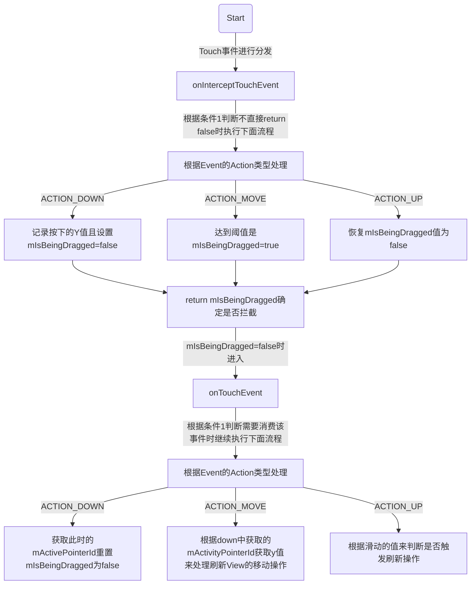

# Rush直播

## 第一部分、启动优化

参考：[深入探索Android启动优化](https://juejin.im/post/5e6f18a951882549422ef333)

### 一、启动优化的意义

启动是App安装和使用的第一印象。

### 二、应用启动流程

- 冷启动
  - 应用进程已经不存在了。点击桌面到主界面的过程。
- 热启动
  - 直接从后台切换到前台
- 温启动
  - 进程存在，只是主界面已经销毁，需要重新创建Activity

#### 冷启动从进程创建到home展示流程

- 桌面点击App startActivity
- AMS startActivity
- AMS检查是否存在当前App进程信息
- AMS startProcessLocked
- 通过Socket传递参数给Zygote进程，并调用ZygoteInit.main()方法来实例化ActivityThread对象并最终返回新进程的pid.
- ActivityThread main
  - ActivityThread attach
  - ActivityThread bindApplication
  - AMS bindApplication
  - ActivityThread handleBindApplication
  - attachBaseContext
  - installContentProVider
  - Application onCreate
  - ActivityThread 进入Loop循环
  - Activity声明周期回调OnCreate、onStart、onResume

### 三、启动耗时检测

#### 1.查看Logcat

在Android Studio Logcat中**过滤关键字“Displayed”**，可以看到对应的冷启动耗时日志。

可以看到Activity启动时间

#### 2.adb shell

```
// 其中的AppstartActivity全路径可以省略前面的packageName
adb shell am start -W [packageName]/[AppstartActivity全路径]
```

- ThisTime: 894 	// 最后一个Activity的启动耗时

- TotalTime: 894  // 表示所有Activity启动耗时

- WaitTime: 915 // AMS启动Activity的总耗时

#### 3.通过代码进行打点

```java
long time = System.currentTimeMillis() - mStartTime;
Log.d(TAG, tag + ": " + time);
```

#### 4.AOP(Aspect Oriented Programing)打点

面向切面之后再进行了解

#### 5.启动速度分析工具-TraceView

- 1、代码中添加：**Debug.startMethodTracing()、检测方法、Debug.stopMethodTracing()**。（需要**使用adb pull将生成的**.trace文件导出到电脑，然后使用Android Studio的Profiler进行加载）

- 2、打开 **Profiler  ->  CPU   ->    点击 Record   ->  点击 Stop  ->  查看Profiler下方Top Down/Bottom Up 区域**，以找出**耗时的热点方法**。

##### Trace Types有三种

- Trace java methods  // 会记录每个方法的时间、cpu信息。对运行时性能影响较大
- Sample Java Methods //相比于Trace Java Methods会记录每个方法的时间、CPU信息，它**会在应用的Java代码执行期间频繁捕获应用的调用堆栈**，对运行时性能的影响比较小，**能够记录更大的数据区域**。
- Sameole c/c++ Functions  // 需部署到**Android 8.0及以上**设备，**内部使用simpleperf跟踪应用的native代码**，也可以命令行使用simpleperf。


#####  5、检查跟踪数据窗口

Profile提供的检查跟踪数据窗口有四种，如下所示：

###### 1、Call Chart

提供函数跟踪数据的图形表示形式。

- **水平轴**：表示**调用的时间段和时间**。
- **垂直轴**：显示**被调用方**。
- **橙色**：**系统API**。
- **绿色**：**应用自有方法**。
- **蓝色**：**第三方API**（包括**Java API**）。

####### 提示

右键点击 Jump to source 跳转至指定函数。

###### 2、Flame Chart

**将具有相同调用方顺序的完全相同的方法收集起来**。

- **水平轴**：**执行每个方法的相对时间量**。
- **垂直轴**：显示**被调用方**。

####### 使用技巧

看**顶层**的**哪个函数占据的宽度最大（表现为平顶）**，可能**存在性能问题**。

###### 3、Top Down

- **递归调用列表**，提供**self、children、total时间和比率来表示被调用的函数信息**。
- **Flame Chart是Top Down列表数据的图形化**。

###### 4、Bottom Up

- **展开函数会显示其调用方**。
- **按照消耗CPU时间由多到少的顺序对函数排序**。

###### 注意事项

我们在查看上面4个跟踪数据的区域时，应该注意右侧的两个时间，如下所示：

- **Wall Clock Time**：**程序执行时间**。
- **Thread Time**：**CPU执行的时间**。

#### 6.启动速度分析工具-Systrace

####7.启动监控

### 四、启动优化常规方案

#### 1.设置Application Theme Window背景

#### 2.第三方库懒加载

Fragment setVisiablehint，特别是应用启动时不需要用到的库

#### 3.异步初始化预备知识-线程优化

#### 4.异步初始化

子线程分担主线程任务，并行减少时间

#### 5.延迟初始化

handler.postDelayed

#### 6.Multidex预加载优化

#### 7.利用MultilDex加载的时间去加载SharedPreferences

#### 8.类加载优化

#### 9.WebView启动优化

#### 10.页面数据预加载

#### 11.启动期间不启动子进程

#### 12.闪屏页面和主页的绘制优化

### 五、启动优化黑科技

#### 1.启动阶段抑制GC

#### 2.CPU锁频

提高CPU的利用率

#### 3.IO优化

#### 4.数据重排

#### 5.类加载优化

### 六、保活

#### 1、厂商合作

#### 2、微信Hardcoder

#### 3、OPPO Hyper Boost加速引擎


## 第二部分 下拉刷新原理(SwipeRefreshLayout)

- [第一篇为测量布局篇](https://www.catbro.cn/detail/5b7fbf4181c44f000f467182.html)
- [第二篇为传统实现篇](https://www.catbro.cn/detail/5b7f711d81c44f000f467180.html)
- [第三篇为嵌套滚动实现篇](https://www.catbro.cn/detail/5b83ba09b88097000ff799d8.html)

### 第一篇 测量布局篇

- SwipeRefreshLayout的实现为二合一的方式
  - 传统的重写onTouchEvent来实现滑动拦截
  - 嵌套滚动实现了NestedScrollingChild和NestedScrollingParent接口

#### 构造函数

- 构造函数源码

```java
public SwipeRefreshLayout(Context context, AttributeSet attrs) {
        super(context, attrs);

         //触发移动事件的最小距离，自定义View处理touch事件的时候，
         //有的时候需要判断用户是否真的存在movie，系统提供了这样的方法。
         //表示滑动的时候，手的移动要大于这个返回的距离值才开始移动控件。

        mTouchSlop = ViewConfiguration.get(context).getScaledTouchSlop();

        //动画的执行时长
        mMediumAnimationDuration = getResources().getInteger(
                android.R.integer.config_mediumAnimTime);
        //一般如果自定义view不需要在onDraw绘制自己的东西时，可以不理会
        setWillNotDraw(false);
        //获取动画的插值器
        mDecelerateInterpolator = new DecelerateInterpolator(DECELERATE_INTERPOLATION_FACTOR);

        //获取设备显示器的指标数据，后面计算需要
        final DisplayMetrics metrics = getResources().getDisplayMetrics();
        //刷新圆的直径，默认是40
        mCircleDiameter = (int) (CIRCLE_DIAMETER * metrics.density);

        //创建一个圆形进度View，下拉时看到的那个就是了
        createProgressView();

        //设置其child的绘制是可以排序的，因为SwipeRefreshLayout总是将下拉的圆形最后再绘制，
        //这样就能一直保证绘制其在最上层可见了
        ViewCompat.setChildrenDrawingOrderEnabled(this, true);

        // the absolute offset has to take into account that the circle starts at an offset
        //下拉触发刷新的偏离距离，默认是64 也就是下拉一个半圆多一点点的距离松开手就可以触发下拉刷新了
        mSpinnerOffsetEnd = (int) (DEFAULT_CIRCLE_TARGET * metrics.density);
        //总共需要拖拽的距离等于触发的距离
        mTotalDragDistance = mSpinnerOffsetEnd;

        //嵌套滑动机制的辅助类
        mNestedScrollingParentHelper = new NestedScrollingParentHelper(this);

        mNestedScrollingChildHelper = new NestedScrollingChildHelper(this);

        //开启嵌套滑动
        setNestedScrollingEnabled(true);

        //最开始的偏离值   当前的偏离值  
        mOriginalOffsetTop = mCurrentTargetOffsetTop = -mCircleDiameter;

        moveToStart(1.0f);

        final TypedArray a = context.obtainStyledAttributes(attrs, LAYOUT_ATTRS);
        setEnabled(a.getBoolean(0, true));
        a.recycle();
    }
```

- mTotalDragDistance
- mOriginalOffsetTop ：刷新view最初的top值
- mCurrentTargetOffsetTop ：刷新view实时的top值
- mSpinnerOffsetEnd ：刷新view触发刷新的阈值

#### onMeasure

```java
 public void onMeasure(int widthMeasureSpec, int heightMeasureSpec) {
        super.onMeasure(widthMeasureSpec, heightMeasureSpec);

        //mTarget 即为下拉的圆形view
        if (mTarget == null) {
            ensureTarget();
        }
        if (mTarget == null) {
            return;
        }

        //内容View，如SwipeRefreshLayout包裹着的RecyclerView
        //SwipeRefreshLayout 减去自己padding，剩下的都给mTarget，使其撑满
        mTarget.measure(MeasureSpec.makeMeasureSpec(
                getMeasuredWidth() - getPaddingLeft() - getPaddingRight(),
                MeasureSpec.EXACTLY), MeasureSpec.makeMeasureSpec(
                getMeasuredHeight() - getPaddingTop() - getPaddingBottom(), MeasureSpec.EXACTLY));

        //刷新控件，大小直接根据给定的硬编码
        mCircleView.measure(MeasureSpec.makeMeasureSpec(mCircleDiameter, MeasureSpec.EXACTLY),
                MeasureSpec.makeMeasureSpec(mCircleDiameter, MeasureSpec.EXACTLY));
        //刷新控件在SwipeRefreshLayuot‘s  childs 中的索引值，后面draw时会用到
        mCircleViewIndex = -1;

        // Get the index of the circleview.
        for (int index = 0; index < getChildCount(); index++) {
            if (getChildAt(index) == mCircleView) {
                mCircleViewIndex = index;
                break;
            }
        }
    }   
```

重要字段

- mCircleViewIndex
- mTarget
- mCircleView

#### onLayout

```java
 protected void onLayout(boolean changed, int left, int top, int right, int bottom) {

      //获取测量到的宽度和高度
      final int width = getMeasuredWidth();
      final int height = getMeasuredHeight();
      //没有child  直接return
      if (getChildCount() == 0) {
          return;
      }

      if (mTarget == null) {
          ensureTarget();
      }
       //没有mTarget 直接 return
      if (mTarget == null) {
          return;
      }

      final View child = mTarget;
      final int childLeft = getPaddingLeft();
      final int childTop = getPaddingTop();
      final int childWidth = width - getPaddingLeft() - getPaddingRight();
      final int childHeight = height - getPaddingTop() - getPaddingBottom();

      //mTarget撑满SwipeRefreshLayout
      child.layout(childLeft, childTop, childLeft + childWidth, childTop + childHeight);

      int circleWidth = mCircleView.getMeasuredWidth();
      int circleHeight = mCircleView.getMeasuredHeight();

      //一直水平居中
      mCircleView.layout((width / 2 - circleWidth / 2), mCurrentTargetOffsetTop,
              (width / 2 + circleWidth / 2), mCurrentTargetOffsetTop + circleHeight);
  }
```


#### 绘制

通过重写getChildDrawingOrder去控制viewgroup绘制child的顺序，viewgroup默认从上至下

```java
protected int getChildDrawingOrder(int childCount, int i) {

  if (mCircleViewIndex < 0) {
      return i;
  } else if (i == childCount - 1) {
      // Draw the selected child last
      //绘制到最后一个时，返回
      return mCircleViewIndex;
  } else if (i >= mCircleViewIndex) {
      // Move the children after the selected child earlier one
      return i + 1;
  } else {
      // Keep the children before the selected child the same
      return i;
  }
}
```

### 第二部分 传统实现篇

- 以touch事件触发开始进行剖析

- 条件：
  - 条件1

```java
 //判断一系列条件看是否需要进行拦截，canChildScrollUp为判断列表是否可以向上滚动（手势从上往下滑）
//mRefreshing处于刷新状态也不会拦截，mNestedScrollInProgress为嵌套滑动机制
if (!isEnabled() || mReturningToStart || canChildScrollUp()
                || mRefreshing || mNestedScrollInProgress) {
            // Fail fast if we're not in a state where a swipe is possible
            return false;
        }
```

- 图



- onInterceptTouchEvent源码如下

```java
public boolean onInterceptTouchEvent(MotionEvent ev) {
          ensureTarget();

          final int action = ev.getActionMasked();
          int pointerIndex;

          //如果正在执行返回到开始位置的动画且触摸为按下时，置为false进行中断操作
          if (mReturningToStart && action == MotionEvent.ACTION_DOWN) {
              mReturningToStart = false;
          }

          //判断一系列条件看是否需要进行拦截，canChildScrollUp为判断列表是否可以向上滚动（手势从上往下滑）
          //mRefreshing处于刷新状态也不会拦截，mNestedScrollInProgress为嵌套滑动机制
          if (!isEnabled() || mReturningToStart || canChildScrollUp()
                  || mRefreshing || mNestedScrollInProgress) {
              // Fail fast if we're not in a state where a swipe is possible
              return false;
          }

          switch (action) {
              case MotionEvent.ACTION_DOWN:
                  setTargetOffsetTopAndBottom(mOriginalOffsetTop - mCircleView.getTop());
                  mActivePointerId = ev.getPointerId(0);
                  mIsBeingDragged = false;

                  pointerIndex = ev.findPointerIndex(mActivePointerId);
                  if (pointerIndex < 0) {
                      return false;
                  }
                  //获取刚按下的y值
                  mInitialDownY = ev.getY(pointerIndex);
                  break;

              case MotionEvent.ACTION_MOVE:
                  if (mActivePointerId == INVALID_POINTER) {
                      Log.e(LOG_TAG, "Got ACTION_MOVE event but don't have an active pointer id.");
                      return false;
                  }

                  pointerIndex = ev.findPointerIndex(mActivePointerId);
                  if (pointerIndex < 0) {
                      return false;
                  }
                  //startDragging中判断是否达到拖拽的阈值
                  final float y = ev.getY(pointerIndex);
                  startDragging(y);
                  break;

              case MotionEvent.ACTION_POINTER_UP:
                  onSecondaryPointerUp(ev);
                  break;

              case MotionEvent.ACTION_UP:
              case MotionEvent.ACTION_CANCEL:
                  mIsBeingDragged = false;
                  mActivePointerId = INVALID_POINTER;
                  break;
          }

          return mIsBeingDragged;
      }
```

- startDragging源码

```java
  private void startDragging(float y) {
        final float yDiff = y - mInitialDownY;
        if (yDiff > mTouchSlop && !mIsBeingDragged) {
            mInitialMotionY = mInitialDownY + mTouchSlop;
            //大于阈值置位true
            mIsBeingDragged = true;
            mProgress.setAlpha(STARTING_PROGRESS_ALPHA);
        }
    }
```

- onTouchEvent源码

```java
public boolean onTouchEvent(MotionEvent ev) {
          final int action = ev.getActionMasked();
          int pointerIndex = -1;

          if (mReturningToStart && action == MotionEvent.ACTION_DOWN) {
              mReturningToStart = false;
          }

          if (!isEnabled() || mReturningToStart || canChildScrollUp()
                  || mRefreshing || mNestedScrollInProgress) {
              // Fail fast if we're not in a state where a swipe is possible
              return false;
          }

          switch (action) {
              case MotionEvent.ACTION_DOWN:
                  mActivePointerId = ev.getPointerId(0);
                  mIsBeingDragged = false;
                  break;

              case MotionEvent.ACTION_MOVE: {
                  pointerIndex = ev.findPointerIndex(mActivePointerId);
                  if (pointerIndex < 0) {
                      Log.e(LOG_TAG, "Got ACTION_MOVE event but have an invalid active pointer id.");
                      return false;
                  }

                  final float y = ev.getY(pointerIndex);
                  startDragging(y);

                  if (mIsBeingDragged) {
                      final float overscrollTop = (y - mInitialMotionY) * DRAG_RATE;
                      if (overscrollTop > 0) {
                          moveSpinner(overscrollTop);
                      } else {
                          return false;
                      }
                  }
                  break;
              }
              case MotionEvent.ACTION_POINTER_DOWN: {
                  pointerIndex = ev.getActionIndex();
                  if (pointerIndex < 0) {
                      Log.e(LOG_TAG,
                              "Got ACTION_POINTER_DOWN event but have an invalid action index.");
                      return false;
                  }
                  mActivePointerId = ev.getPointerId(pointerIndex);
                  break;
              }

              case MotionEvent.ACTION_POINTER_UP:
                  onSecondaryPointerUp(ev);
                  break;

              case MotionEvent.ACTION_UP: {
                  pointerIndex = ev.findPointerIndex(mActivePointerId);
                  if (pointerIndex < 0) {
                      Log.e(LOG_TAG, "Got ACTION_UP event but don't have an active pointer id.");
                      return false;
                  }

                  if (mIsBeingDragged) {
                      final float y = ev.getY(pointerIndex);
                      final float overscrollTop = (y - mInitialMotionY) * DRAG_RATE;
                      mIsBeingDragged = false;
                      finishSpinner(overscrollTop);
                  }
                  mActivePointerId = INVALID_POINTER;
                  return false;
              }
              case MotionEvent.ACTION_CANCEL:
                  return false;
          }

          return true;
      } 
```

- finishSpinner 源码如下，该方法在up时触发，

```java

private void finishSpinner(float overscrollTop) {

  if (overscrollTop > mTotalDragDistance) {
         //此时滑动距离大于阈值，触发刷新操作
      setRefreshing(true, true /* notify */);
  } else {
      // cancel refresh
      mRefreshing = false;
      mProgress.setStartEndTrim(0f, 0f);
      Animation.AnimationListener listener = null;
      if (!mScale) {
          listener = new Animation.AnimationListener() {

              @Override
              public void onAnimationStart(Animation animation) {
              }

              @Override
              public void onAnimationEnd(Animation animation) {
                  if (!mScale) {
                      startScaleDownAnimation(null);
                  }
              }

              @Override
              public void onAnimationRepeat(Animation animation) {
              }

          };
      }
      animateOffsetToStartPosition(mCurrentTargetOffsetTop, listener);
      mProgress.setArrowEnabled(false);
  }
}
```

### 第三篇嵌套滑动

#### [Android嵌套滑动：NestedScrollingChild使用详解](https://www.catbro.cn/detail/5b7a612581c44f000f46717c.html)

- 如果你希望内部嵌套的View可以进行嵌套事件的分发以便与外部的父View配合，此时可以实现此接口，
- 实现此接口的类应该创建NestedScrollingChildHelper的最终实例作为字段，并将任何View方法委托给相同签名的NestedScrollingChildHelper方法。 因为 Helper 类中已经实现好了 Child 和 Parent 交互的逻辑。原来的 View 的处理 Touch 事件，并实现滑动的逻辑大体上不需要改变
- 调用嵌套滚动功能的视图应始终从相关的ViewCompat，ViewGroupCompat或ViewParentCompat兼容性填充静态方法执行此操作。 这确保了与Android 5.0 Lollipop和更新版本上的嵌套滚动视图的互操作性。


###### 方法

| 返回值           | 方法名称                                                     | 描述                                                         |
| ---------------- | ------------------------------------------------------------ | ------------------------------------------------------------ |
| abstract boolean | dispatchNestedFling(float velocityX, float velocityY, boolean consumed) | 分发一个fling事件给支持嵌套滚动的父类，该方法通常被使用去标识当前的子View已经通过一定的条件检测到一个fling事件，通常情况下此时touch事件已经结束并且在滚动的方向此时存在一个符合或者超过最小fling的速度，此时子View可以将fling分发给父view处理，父View可以消费此事件，也可以观察子View的处理情况；如果子View消费了，consumed为true，反之为false，velocityX为横向的速度，velocityY为纵向的速度 |
| abstract boolean | dispatchNestedPreFling(float velocityX, float velocityY)     | 在当前View处理该fling事件之前将该fling事件转发给支持嵌套滚动的父View，如果返回true则父View已经消费了该fling事件，子View不应该再做处理 |
| abstract boolean | dispatchNestedPreScroll(int dx, int dy, int[] consumed, int[] offsetInWindow) | 在此View消耗任何事件之前，调度该方法先询问你的父View是否需要滑动，嵌套的预滚动事件是嵌套滚动事件触摸拦截的触摸。 dispatchNestedPreScroll为嵌套滚动操作中的父视图提供了在子视图使用之前使用部分或全部滚动操作的机会。 |
| abstract boolean | dispatchNestedScroll(int dxConsumed, int dyConsumed, int dxUnconsumed, int dyUnconsumed, int[] offsetInWindow) | 在当前View处理完本次的滑动操作后，再次询问父View是否需要滑动，支持嵌套滚动的视图实现应调用此方法将有关正在进行的滚动的信息报告给当前嵌套滚动父级。 如果嵌套滚动当前未在进行中，或者未对此视图启用嵌套滚动，则此方法不执行任何操作。 兼容的View实现也应该在使用scroll事件的一个组件之前调用dispatchNestedPreScroll。 |
| abstract boolean | hasNestedScrollingParent()                                   | 是否存在有支持内部嵌套的父View，true表示存在                 |
| abstract boolean | isNestedScrollingEnabled()                                   | 如果当前view的内部嵌套滚动式开启的，则返回true               |
| abstract void    | setNestedScrollingEnabled(boolean enabled)                   | 开启或者关闭当前view的嵌套滚动                               |
| abstract boolean | startNestedScroll(int axes)                                  | 沿给定轴开始嵌套滚动操作。如果你需要进行滚动了，此时应该调用该事件告诉父View你要开始滚动了 |
| abstract void    | stopNestedScroll()                                           | 停止正在进行的嵌套滚动。如果你要停止滚动了，调用该方法告诉父类 |

###### 基本原理

- 如果要准备开始滑动了，需要告诉 Parent，你要准备进入滑动状态了，调用 startNestedScroll()。你在滑动之前，先问一下你的 Parent 是否需要滑动，也就是调用dispatchNestedPreScroll()。如果父类滑动了一定距离，你需要重新计算一下父类滑动后剩下给你的滑动距离余量。然后，你自己进行余下的滑动。最后，如果滑动距离还有剩余，你就再问一下，Parent 是否需要在继续滑动你剩下的距离，也就是调用 dispatchNestedScroll()。

###### 图解

- A状态为刚触发滚动事件的时候
- B状态为当前View正在处理滚动事件
- C状态为当前View已经处理完滚动事件

```sequence
Diagram

participant A 
participant B 
participant C 
A->>A: 1、startNestedScroll(int axes)通知parent你已经进入滚动状态，axes为滑动的轴类型变量
A->>A:2、dispatchNestedPreScroll(int dx, int dy, int[] consumed, int[] offsetInWindow)询问parent是否需要消耗当前的滚动事件，如果parent消耗了，你需要根据consumed重新计算parent给你的剩余的滑动距离
A->>B:3、获得自己可滑动的距离
B->>B:4、处理滑动操作
B->>C:5、已处理完滑动操作
C->>C:6、dispatchNestedScroll(int dxConsumed, int dyConsumed, int dxUnconsumed, int dyUnconsumed, int[] offsetInWindow)自己处理完滑动后再次询问parent是否需要滑动
C->>C:7、stopNestedScroll()通知parent本次滚动事件到此结束

```

- fling事件类推

###### NestedScrollingChildHelper

- 上面图解中我们梳理了嵌套滑动机制中child将滑动信息发送给parent的大体流程。
- 实现过NestedScrollingChild 接口的小伙伴都知道，Google相当的贴心，大部分核心的工作都帮我们实现了，我们只需要在响应的接口调用NestedScrollingChildHelper中相同签名的函数即可，然后在监听滑动事件的回调中调用一下对应接口即可。
- 为了更好地理解NestedScrolingChild的工作工程，接下来我们将浅析NestedScrollingChildHelper这个类的具体实现。
- 我们的分析过程还是会根据上面的图解来进行切入。
- 1、startNestedScroll(int axes)：在child进入滑动状态时，通知parent此时的状态，startNestedScroll(int axes)内部直接调用的是NestedScrollingChildHelper响应签名的函数，我们来看下NestedScrollingChildHelper.startNestedScroll(int axes)

```java
public void setNestedScrollingEnabled(boolean enabled) {
       //此处不是很理解，为何原来是开启状态，后面set值时要先停止内部滚动，而不先判断enable为false时再停止呢？
       //虽然如果此时view不处于嵌套滑动状态，调用该方法也不影响
        if (this.mIsNestedScrollingEnabled) {
            ViewCompat.stopNestedScroll(this.mView);
        }

        this.mIsNestedScrollingEnabled = enabled;
    }

 public boolean isNestedScrollingEnabled() {
        return this.mIsNestedScrollingEnabled;
    }

 public boolean hasNestedScrollingParent() {
    return this.mNestedScrollingParent != null;
  }

 public boolean startNestedScroll(int axes) {
    //从上面可以看到起直接返回mNestedScrollingParent是否是null，
    //作用是保证即使你多次调用startNestedScroll也只会通知一次parent，
    //当你调用了一次startNestedScroll后，mNestedScrollingParent是不为null的
    if (this.hasNestedScrollingParent()) {
        return true;
    } else {

        //判断全套滚动是否开启
        if (this.isNestedScrollingEnabled()) {

            //获取child的parent
            ViewParent p = this.mView.getParent();

            //遍历child的所有parent
            for(View child = this.mView; p != null; p = p.getParent()) {

                 //这点很关键，如果parent中在onStartNestedScroll中返回ture，就不会继续向上寻找其他parent，
                 //同时，也只有onStartNestedScroll中返回true时，onNestedScrollAccepted才会被调用，
                 //这个在下一篇讲解NestedScrollingParent中会讲到
                if (ViewParentCompat.onStartNestedScroll(p, child, this.mView, axes)) {

                    //parent确定消费此滑动事件后，就会给mnestedScrollingParent赋值，
                    //在stopNestedScroll中会将其重置为null
                    //这样就会保证了一个嵌套滑动事件的传递在startNestedScroll到stopNestedScroll期间只会与
                    //其中一个parent进行交互，避免错误多次调用startNestScroll所引发的问题
                    this.mNestedScrollingParent = p；

                    ViewParentCompat.onNestedScrollAccepted(p, child, this.mView, axes);
                    return true;
                }

                //若parent未消费该滑动事件，则会走这一步，然后继续调用p.getParent向上寻找新的parent，
                //这就是嵌套滑动时并未要求其必须是直接child的原因
                if (p instanceof View) {
                    child = (View)p;
                }
            }
        }

        return false;
    }
}
```

- 之后child在滑动前便会通知parent，其调用的NestedScrollingChildHelper对应的方法是：

```java
public boolean dispatchNestedPreScroll(int dx, int dy, int[] consumed, int[] offsetInWindow) {

       //同样，先做一下判断，如果未开启或者在startNestedScroll中未找到符合要求的parent，后面的代码也就没必要执行了
        if (this.isNestedScrollingEnabled() && this.mNestedScrollingParent != null) {

             //如果dx 或者dy其中一个不为0，也就是滑动了，则执行下面代码
            if (dx != 0 || dy != 0) {

                //声明两个变量来存储当前child相对于parent的x和y的值
                int startX = 0;
                int startY = 0;
                //如果你想在执行完dispatchNestedPreScroll后想知道自己x和y相对于parent的值时多少，
                //那么可以传递一个offsetInWindow对象进来进行获取
                if (offsetInWindow != null) {
                    //在分发滑动数据给parent前先获取一次自己相对于parent的x，y值
                    this.mView.getLocationInWindow(offsetInWindow);
                    startX = offsetInWindow[0];
                    startY = offsetInWindow[1];
                }

                if (consumed == null) {
                    if (this.mTempNestedScrollConsumed == null) {
                        this.mTempNestedScrollConsumed = new int[2];
                    }

                    consumed = this.mTempNestedScrollConsumed;
                }

                consumed[0] = 0;
                consumed[1] = 0;

                //这里会调用onNestedPreScroll，将对应的参数传递给parent
                ViewParentCompat.onNestedPreScroll(this.mNestedScrollingParent, this.mView, dx, dy, consumed);

                //parent的onNestedPreScroll执行后再次获取此时的x，y的值
                if (offsetInWindow != null) {
                    this.mView.getLocationInWindow(offsetInWindow);

                    //通过计算，如果值大于0，parent向上滑了，反之则parent向下滑了
                    offsetInWindow[0] -= startX;
                    offsetInWindow[1] -= startY;
                }
                //返回true，则代表parent消费了dx或者dy的数值
                return consumed[0] != 0 || consumed[1] != 0;
            }

            if (offsetInWindow != null) {
                offsetInWindow[0] = 0;
                offsetInWindow[1] = 0;
            }
        }

        return false;
    }
```

- child滑动后再次通知parent

```java
public boolean dispatchNestedScroll(int dxConsumed, int dyConsumed, int dxUnconsumed, int dyUnconsumed, int[] offsetInWindow) {

     //同样先判断
     if (this.isNestedScrollingEnabled() && this.mNestedScrollingParent != null) {
         if (dxConsumed != 0 || dyConsumed != 0 || dxUnconsumed != 0 || dyUnconsumed != 0) {
             int startX = 0;
             int startY = 0;
             if (offsetInWindow != null) {
                 this.mView.getLocationInWindow(offsetInWindow);
                 startX = offsetInWindow[0];
                 startY = offsetInWindow[1];
             }

             //将自己消费了的dx 和dy以及未消费的dx 和dy传递给parent，以便parent继续消费dx 和dy
             ViewParentCompat.onNestedScroll(this.mNestedScrollingParent, this.mView, dxConsumed, dyConsumed, dxUnconsumed, dyUnconsumed);
             if (offsetInWindow != null) {
                 this.mView.getLocationInWindow(offsetInWindow);
                 offsetInWindow[0] -= startX;
                 offsetInWindow[1] -= startY;
             }

             return true;
         }

         if (offsetInWindow != null) {
             offsetInWindow[0] = 0;
             offsetInWindow[1] = 0;
         }
     }

     return false;
 }

```

- 最后stopNestedScroll

```java
 public void stopNestedScroll() {
        if (this.mNestedScrollingParent != null) {
            ViewParentCompat.onStopNestedScroll(this.mNestedScrollingParent, this.mView);
            //重置为null
            this.mNestedScrollingParent = null;
        }

    }
```

#### [Android嵌套滑动：NestedScrollingParent使用详解](https://www.catbro.cn/detail/5b7a644181c44f000f46717d.html)

- 此接口应由希望支持嵌套子视图委派的滚动操作的ViewGroup子类实现。
- 实现此接口的类应该创建NestedScrollingParentHelper的最终实例作为字段，并将任何View或ViewGroup方法委托给相同签名的NestedScrollingParentHelper方法。
- 调用嵌套滚动功能的视图应始终从相关的ViewCompat，ViewGroupCompat或ViewParentCompat兼容性填充静态方法执行此操作。 这确保了与Android 5.0 Lollipop和更新版本上的嵌套滚动视图的互操作性。

###### 方法

| 返回值           | 方法名                                                       | 描述                                                         |
| ---------------- | ------------------------------------------------------------ | ------------------------------------------------------------ |
| abstract int     | getNestedScrollAxes()                                        | 返回此NestedScrollingParent的嵌套滚动的当前轴。返回除SCROLL_AXIS_NONE外的值，一般为SCROLL_AXIS_HORIZONTAL或SCROLL_AXIS_VERTICAL |
| abstract boolean | onNestedFling(View target, float velocityX, float velocityY, boolean consumed) | 从嵌套滚动请求fling。该方法的调用表示嵌套滚动子View通过某些条件检测到了fling事件 |
| abstract boolean | onNestedPreFling(View target, float velocityX, float velocityY) | 在目标视图消耗它之前对嵌套的fling做出反应。                  |
| abstract void    | onNestedPreScroll(View target, int dx, int dy, int[] consumed) | 在嵌套滚动子View对滚动事件作出响应之前，通过该方法父View可以先行消费该滚动事件，对正在进行的嵌套滚动作出反应。 |
| abstract void    | onNestedScroll(View target, int dxConsumed, int dyConsumed, int dxUnconsumed, int dyUnconsumed) | 对正在进行的嵌套滚动做出反应。当ViewParent的当前嵌套子View分发了嵌套滚动事件时该方法将被调用，只有在onStartNestedScroll(View, View, int).返回true时该方法才会被调用 |
| abstract void    | onNestedScrollAccepted(View child, View target, int axes)    | 对成功处理嵌套滚动操作做出反应。该方法将在onStartNestedScroll返回true时被调用，它为视图及其超类提供了对嵌套滚动执行初始配置的机会，此方法的实现应始终调用其超类的此方法的实现 |
| abstract boolean | onStartNestedScroll(View child, View target, int axes)       | 对启动可嵌套滚动操作的后代视图做出反应，声明嵌套滚动操作（如果适用） |
| abstract void    | onStopNestedScroll(View target)                              | 对嵌套滚动操作结束的反应。                                   |

###### 图解

- A：刚进入滚动状态时接收到child发来的通知
- B：开始处理滚动

注解

- 注解1：当child刚进入滚动状态时，会回调onStartNestedScroll，通常在该方法中我们根据一定的条件返回true或者false，true表示你需要接收嵌套滑动child的滑动数据，让child先不要动，放着让你来
- 注解2：如果onStartNestedScroll返回true时，该方法接下来会被回调（为什么返回true时才被回调在上一篇分析NestedScrollingChild时已将分析了，不大清楚的小伙伴可以点击看一下）。在该方法中我们通常做一些处理滑动前的准备功能，如初始化一个变量等。
- 注解3：嵌套child在处理滑动前为了遵从中华人名优良的文化传统-尊老爱幼，先把拿到的滑动量传递给嵌套parent，此时onNestedPreScroll被回调，在这里我们可以优先于child把滑动的偏移量消费掉，然后将消费了多少通过放入consumed中回传给child（int[]类型是地址引用）
- 注解4：child在parent执行完接onNestedPreScroll里的代码后开始执行自己的操作，然后child是个相当不错的孩子，他还将自己消费了多少，还剩多少可以消费再次告知parent，此时parent的onNestedScroll函数被调用，一般在该方法中可以根据实际情况做一些操作
- 注解5：在结束的时候，我们的好孩子child依然保持有始有终的做事理念告知我们的parent，我的滑动结束了，此时parent的onStopNestedScroll被调用，可以在这里做一些变量的重置工作

```sequence
participant A 
participant B 
participant C 
A->>A:onStartNestedScroll(View child, View target, int axes)->注解1 
A->>A:onNestedScrollAccepted(View child, View target, int axes)->注解2 
A-->>B:child开始要处理滑动操作了 
B->>B:onNestedPreScroll(View target, int dx, int dy, int[] consumed)->注解3 
B->>B:onNestedScroll(View target, int dxConsumed, int dyConsumed, int dxUnconsumed, int dyUnconsumed)->注解4 
B-->>C:滑动进入结束阶段 
C->>C:onStopNestedScroll->注解5


```

- NestedScrollingParentHelper代码相对比较少，这里就不做讲解，感兴趣的可以看下

```java
public class NestedScrollingParentHelper {
    private final ViewGroup mViewGroup;
    private int mNestedScrollAxes;

    public NestedScrollingParentHelper(ViewGroup viewGroup) {
        this.mViewGroup = viewGroup;
    }

    public void onNestedScrollAccepted(View child, View target, int axes) {
        this.mNestedScrollAxes = axes;
    }

    public int getNestedScrollAxes() {
        return this.mNestedScrollAxes;
    }

    public void onStopNestedScroll(View target) {
        this.mNestedScrollAxes = 0;
    }
}
```

#### 嵌套滑动篇

- 我们在上一篇分析了SwipeRefreshlayout中传统事件拦截实现下拉刷新的代码。
- 本篇将分析其通过嵌套滑动实现下拉刷新的代码。
- 在前面的嵌套滑动相关文章中，我们也分析了NestedScrollingParent 和NestedScrollingChild的使用流程，这里就不再细说，有需要的小伙伴可以前往搜索NestedScrollingParent 和NestedScrollingChild。

##### 解码开始

- ok，看到这里就默认你已经了解了NestedScrollingChild和NestedScrollingParent的使用
- 为了便于描述，假设RV为实现了NestedScrollingChild接口的View，如RecyclerView，SRL为SwipeRefreshLayout的简称

图形：

- 交互图如下：

```sequence
Diagram 
participant RV 
participant SRL 
RV -->> SRL:1、进入滑动状态，调用startNestedScroll 
SRL -->> SRL:2、onStartNestedScroll被回调，执行代码块1 
SRL -->> SRL:3、当onStartNestedScroll返回true时，NestedScrollAccepted将被调用，看代码块2 
RV -->> SRL:4、RV处理滚动操作前调用dispatchNestedPreScroll通知SRL 
SRL -->> SRL:5、onNestedPreScroll被回调，看代码块3 
RV -->> SRL:6、RV处理滚动操作后调用dispatchNestedScroll通知SRL 
SRL -->> SRL:7、onNestedScroll被回调，看代码块4 
RV -->> SRL:8、RV处理滚动操作结束后调用stopNestedScroll()通知SRL 
SRL -->> SRL:9、stopNestedScroll()被回调，主要重置一些状态变量，看代码块5
```

```java
      @Override
        public boolean onStartNestedScroll(View child, View target, int nestedScrollAxes) {
            //reture true时SRL将接受嵌套滑动,主要是判断是否在非刷新状态中和滚动轴为垂直的
            return isEnabled() && !mReturningToStart && !mRefreshing
                    && (nestedScrollAxes & ViewCompat.SCROLL_AXIS_VERTICAL) != 0;
```

  ```java
  public void onNestedScrollAccepted(View child, View target, int axes) {
        // Reset the counter of how much leftover scroll needs to be consumed.
        mNestedScrollingParentHelper.onNestedScrollAccepted(child, target, axes);
        // Dispatch up to the nested parent

        //通知SRL的父类，如CoordinatorLayout
        startNestedScroll(axes & ViewCompat.SCROLL_AXIS_VERTICAL);

       //做一些字段的初始化
        mTotalUnconsumed = 0; //记录SRL一共使用了多少y值得量
        mNestedScrollInProgress = true;  //标记嵌套滑动开始此时传统触摸事件模式失效
    }
  ```

```java
@Override
    public void onNestedPreScroll(View target, int dx, int dy, int[] consumed) {

        //执行该代码的情况是你往下拖拽然后网上拖拽，此时需要优先于RV的滚动以便恢复刷新View的状态
        //dy大于0为向上滑动产生，而mTotalUnconsumed大于0说明SRL已经有消耗过y值了
        if (dy > 0 && mTotalUnconsumed > 0) {
            if (dy > mTotalUnconsumed) {
                consumed[1] = dy - (int) mTotalUnconsumed;
                mTotalUnconsumed = 0;
            } else {
                mTotalUnconsumed -= dy;
                consumed[1] = dy;
            }
            //将刷新view移动回mTotalUnconsumed只对应的位置，正值view向下移动，负值向上移动
            moveSpinner(mTotalUnconsumed);
        }

        //自定义View的情况，可不理会
        if (mUsingCustomStart && dy > 0 && mTotalUnconsumed == 0
                && Math.abs(dy - consumed[1]) > 0) {
            mCircleView.setVisibility(View.GONE);
        }

        // Now let our nested parent consume the leftovers
        //同样，将嵌套滑动向上传递
        final int[] parentConsumed = mParentScrollConsumed;
        if (dispatchNestedPreScroll(dx - consumed[0], dy - consumed[1], parentConsumed, null)) {
            consumed[0] += parentConsumed[0];
            consumed[1] += parentConsumed[1];
        }
    }
```

```java
@Override
    public void onNestedScroll(final View target, final int dxConsumed, final int dyConsumed,
            final int dxUnconsumed, final int dyUnconsumed) {
        // Dispatch up to the nested parent first
        //同样，消费嵌套滑动数据前先向上传递，让parent先消费
        dispatchNestedScroll(dxConsumed, dyConsumed, dxUnconsumed, dyUnconsumed,
                mParentOffsetInWindow);
        //当parent有消费时，SRL相对于Parent的位置可能会改变，所以要结合mParentOffsetInWindow[1]的值来做处理
        final int dy = dyUnconsumed + mParentOffsetInWindow[1];
       //dy<0为从上向下滑动
       if (dy < 0 && !canChildScrollUp()) {
           //如果canChildScrollUp()为false，及RV已经滑到顶部了，不能再下拉了，此时自然是SRL的刷新View要出现了
            mTotalUnconsumed += Math.abs(dy);
            //调用moveSpinner来控制SRL刷新View的移动
            moveSpinner(mTotalUnconsumed);
        }
    }
```

```java
@Override
    public void onStopNestedScroll(View target) {
        mNestedScrollingParentHelper.onStopNestedScroll(target);
        //重置变量为false
        mNestedScrollInProgress = false;
        // Finish the spinner for nested scrolling if we ever consumed any
        // unconsumed nested scroll
        if (mTotalUnconsumed > 0) {
        //类似于手势操作up的处理，结束时判断刷新View此时的状态是应该进入刷新状态还是回复到默认位置，代码看下面

            finishSpinner(mTotalUnconsumed);
            mTotalUnconsumed = 0;
        }
        // Dispatch up our nested parent
        stopNestedScroll();
        }  
```

```java
private void finishSpinner(float overscrollTop) {
        if (overscrollTop > mTotalDragDistance) {
            setRefreshing(true, true /* notify */);
        } else {
            // cancel refresh
            mRefreshing = false;
            mProgress.setStartEndTrim(0f, 0f);
            Animation.AnimationListener listener = null;
            if (!mScale) {
                listener = new Animation.AnimationListener() {

                    @Override
                    public void onAnimationStart(Animation animation) {
                    }

                    @Override
                    public void onAnimationEnd(Animation animation) {
                        if (!mScale) {
                            startScaleDownAnimation(null);
                        }
                    }

                    @Override
                    public void onAnimationRepeat(Animation animation) {
                    }

                };
            }
            animateOffsetToStartPosition(mCurrentTargetOffsetTop, listener);
            mProgress.setArrowEnabled(false);
        }
    }
```


## 第三部分 MVVM原理

### [Android Jetpack 架构组件之 Lifecycle（源码篇）](https://juejin.im/post/5c4e9f496fb9a04a027abdd9)

### [Android Paging](https://www.jianshu.com/p/10bf4bf59122)

### [Android Jetpack 架构组件之 ViewModel （源码篇](https://juejin.im/post/5c4e9f77e51d45522c305c32)

### [Android Jetpack 架构组件之 LiveData（使用、源码篇）](https://juejin.im/post/5c4e9fbf6fb9a049bd42b039)

### [Android Jetpack架构组件之WorkManger](https://juejin.im/post/5c4ea0686fb9a049ec6b760f)

## 第四部分 Fragment完全解析

#### 为什么要用Fragment

Fragment是Android 3.0 (Honeycomb)被引入的。主要目的是为了给大屏幕(如平板电脑)上更加动态和灵活的UI设计提供支持。由于平板电脑的屏幕比手机的屏幕大很多，因此可用于组合和交换的UI组件的空间更大，利用Fragment实现此类设计的时，就无需管理对视图层次结构的复杂更改。

除此之外，使用Fragment还有这么几个方面优势：

- 代码复用。特别适用于模块化的开发，因为一个Fragment可以被多个Activity嵌套，有个共同的业务模块就可以复用了，是模块化UI的良好组件。
- Activity用来管理Fragment。Fragment的生命周期是寄托到Activity中，Fragment可以被Attach添加和Detach释放。
- 可控性。Fragment可以像普通对象那样自由的创建和控制，传递参数更加容易和方便，也不用处理系统相关的事情，显示方式、替换、不管是整体还是部分，都可以做到相应的更改。
- Fragments是view controllers，它们包含可测试的，解耦的业务逻辑块，由于Fragments是构建在views之上的，而views很容易实现动画效果，因此Fragments在屏幕切换时具有更好的控制。

#### Fragment加载到Activity的两种方式

- 静态加载 XML布局中
  - 使用 标签，通过设置 class 或 name 任意一个属性，指定我们的 Fragment
- 动态加载
  - 在 activity 中预先定义一个装载 Fragment 的容器，一般我们使用 FramLayout 
  - 然后在 activity 中通过 activity.getFragmentManager() 方法 获取 FragmentManager 
  - FragmentManager.beginTransaction() 方法， 开启一个事物，获取 FragmentTransaction
  - 通过 FragmentTranslation 的 add replace remove 方法 添加 替换 删除 Fragment
  - 需要注意的是，最后要使用 FragmentTranslation 的 commit 方法，完成整个步骤。

#### FragmentPagerAdapter 和 FragmentStatePagerAdapter 的区别

相同点：

- FragmentPagerAdapter 和 FragmentStatePagerAdapter 都是抽象类 PagerAdapter 的子类，他们多数的使用使用情况都是结合 ViewPager 来制作 app 主页。

不同点：

- FragmentPagerAdapter 的 destroyItem 的时候并没有直接销毁 item，只是分离了 UI
- FragmentStatePagerAdapter 是直接销毁了 Fragment
- Fragment 多的时候选择 FragmentStatePagerAdapter，少的时候选择 FragmentPagerAdapter

#### fragment声明周期

- onAttach
- onCreate
- onCreateView
- onActivityCreated
- onStart
- onResume
- Fragment is active
- onPause
- onStop
- onDestroyView
- onDestroy
- onDetach

**onAttach()**
在 Fragment 与 activity 发生关联的时候调用

**onCreateView(LayoutInflater, ViewGroup,Bundle)**
创建 Fragment 视图的调用

**onActivityCreated()**
当 activity 的 onCreate() 方法调用的时候被调用

**onDestoryView()**
与 onCreateView() 方法相对应 当 Fragment 视图被移除时被调用

**onDetach()**
与 onAttach() 对应 当 Fragment 与 activity 解除关联的时候被调用

#### Fagment通信

- Activity 操作内嵌的 Fragment
  - Activity 持有所有内嵌的 Fragment 对象实例（创建实例时保存的 Fragment 对象，或者通过 FragmentManager 类提供的 findFragmentById() 和 findFragmentByTag() 方法也能获取到 Fragment 对象），所以可以直接操作 Fragment；
- Fragment 操作宿主 Activity
  - Fragment 通过 `getActivity()` 方法可以获取到宿主 Activity 对象（强制转换类型即可），进而可以操作宿主 Activity；
- Fragment 操作同属 Activity中的其他 Fragment。
  - 那么很自然的，获取到宿主 Activity 对象的 Fragment 便可以操作其他 Fragment 对象。

- Handler
- 广播
- EventBus
- 接口回调
- Bundle和setArguments(bundle)
- 宿主不同时
  - 可以通过 getActivity().startActivityForResult() 和 onActivityResult() 进行两个 Fragment 间的信息传递。
- 

#### Fragment、FragmentManager、FragmentTransaction 关系

- Fragment
  - 其实是对 View 的封装，它持有 view, containerView, fragmentManager, childFragmentManager 等信息
- FragmentManager
  - 是一个抽象类，它定义了对一个 Activity/Fragment 中 **添加进来的 Fragment 列表**、**Fragment 回退栈**的操作、管理方法
  - 还定义了获取事务对象的方法
  - 具体实现在 FragmentImpl 中
- FragmentTransaction
  - 定义了对 Fragment 添加、替换、隐藏等操作，还有四种提交方法
  - 具体实现是在 BackStackRecord 中

#### Fragment的懒加载

- setUserVisibleHint(boolean isVisibleToUser) 
  - 标记已加载完成，保证懒加载只能加载一次
  - 标记Fragment是否已经onCreate
  - 界面对于用户是否可见

#### Fragment 事务的四种提交方式

事务最终的提交方法有四种：

1. `commit()`
2. `commitAllowingStateLoss()`
3. `commitNow()`
4. `commitNowAllowingStateLoss()`

**它们之间的特点及区别如下：**

```java
public abstract int commit();
```

`commit()` 在主线程中异步执行，其实也是 Handler 抛出任务，等待主线程调度执行。

> 注意：
> `commit()` 需要在宿主 Activity 保存状态之前调用，否则会报错。
> 这是因为如果 Activity 出现异常需要恢复状态，在保存状态之后的 `commit()` 将会丢失，这和调用的初衷不符，所以会报错。


```java
public abstract int commitAllowingStateLoss();
```

`commitAllowingStateLoss()` 也是异步执行，但它的不同之处在于，允许在 Activity 保存状态之后调用，也就是说它遇到状态丢失不会报错。

因此我们一般在界面状态出错是可以接受的情况下使用它。

**public** **abstract** **void** **commitNow**();

`commitNow()` 是同步执行的，立即提交任务。

前面提到 `FragmentManager.executePendingTransactions()` 也可以实现立即提交事务。但我们一般建议使用 `commitNow()`, 因为另外那位是一下子执行所有待执行的任务，可能会把当前所有的事务都一下子执行了，这有可能有副作用。

> 此外，这个方法提交的事务可能不会被添加到 FragmentManger 的后退栈，因为你这样直接提交，有可能影响其他异步执行任务在栈中的顺序。

和 `commit()` 一样，`commitNow()` 也必须在 Activity 保存状态前调用，否则会抛异常。

```java
public abstract void commitNowAllowingStateLoss();
```

同步执行的 `commitAllowingStateLoss()`。

OK，了解了 `FragmentTransaction` 定义的操作，去看看我们真正关心的、 `beginTransaction()` 中返回的 `BackStackRecord`:

```java
@Override
public FragmentTransaction beginTransaction() {
    return new BackStackRecord(this);
}
```

#### Fragment 如何实现布局的添加替换

通过获得当前 Activity/Fragment 的 FragmentManager/ChildFragmentManager，进而拿到事务的实现类 BackStackRecord，它将目标 Fragment 构造成 Ops（包装Fragment 和状态信息），然后提交给 FragmentManager 处理。

如果是异步提交，就通过 Handler 发送 Runnable 任务，FragmentManager 拿到任务后，先处理 Ops 状态，然后调用 `moveToState()` 方法根据状态调用 Fragment 对应的生命周期方法，从而达到 Fragment 的添加、布局的替换隐藏等。

#### 嵌套 Fragment 的原理

也比较简单，Fragment 内部有一个 childFragmentManager，通过它管理子 Fragment。

在添加子 Fragment 时，把子 Fragment 的布局 add 到父 Fragment 即可。

#### Fragment生命周期
onAttach
onCreate
onCreateView
onActivityCreate                ______以上相当于Activity的onCreate方法


onStart                             ______相当于Activity的onStart方法
onResume                        ______相当于Activity的onResume方法
onPause                           ______相当于Activity的onPause方法
onStop                             ______相当于Activity的onStop方法


onDestroyView
onDestroy
onDetach                         ______以上相当于Activity的onDestroy方法


当Activity包含一个Fragment的时候，Activity和Fragment生命周期的变化：
Activity（onCreate）---> Fragment（onAttach onCreate onCreateView onActivityCreate）--->
Activity（onStart）---> Fragment（onStart）--->
Activity（onResume）---> Fragment（onResume）--->
Fragment（onPause）---> Activity（onPause）--->
Fragment（onStop）---> Activity（onStop）--->
Fragment（onDestroyView onDestroy onDetach）---> Activity（onDestroy）
由于Fragment依附于Activity，所以启动的时候Activity的方法肯定在前面，Fragment的方法在后面，但是在要销毁的时候，Fragment的方法先执行，再执行Activity的方法。


在宿主Activity中使用hide、show方式切换Fragment的时候，Fragment的生命周期是：
a 初始化
Fragment1（onAttach onCreate onCreateView onActivityCreate） --->  Fragment1（onStart）---> Fragment1（onResume）
Fragment2（onAttach onCreate onCreateView onActivityCreate） --->  Fragment2（onStart）---> Fragment2（onResume）
b Fragment1和Fragment2来回切换都没有回调生命周期
c 当某一个Fragment调用了跳转到另一个Activity的时候(或者按HOME键的时候)
Fragment1（onPause）---> Fragment1（onStop）
Fragment2（onPause）---> Fragment2（onStop）
d 当在一个透明的Activity中弹出一个Dialog时（与Activity的情况相同）
Fragment1（onPause）
Fragment2（onPause）
e 当宿主Activity被销毁的时候
Fragment1（onPause）---> Fragment1（onStop）---> Fragment1（onDestroyView onDestroy onDetach）
Fragment2（onPause）---> Fragment2（onStop）---> Fragment2（onDestroyView onDestroy onDetach）

当采用FragmentStatePagerAdapter适配器加载‘Fragment的时候，Fragment的生命周期同上面的情况相同。

#### fragment各种情况下的生命周期

onAttach()：当Fragment与Activity发生关联时，该方法被调用

onCreateView()：创建Fragment的视图

onActivityCreate()：当Activity的onCreate()返回时被调用

onDestoryView()：与onCreateView()是对应的，当Fragment的视图被销毁时，该方法被调用

onDetach()： 与onAttach() 方法相对应，当Fragment与Activity的关联被取消时，该方法被调用

Activity中调用replace()方法时的生命周期

新替换的Fragment：onAttach > onCreate > onCreateView > onViewCreated > onActivityCreated > onStart > onResume

被替换的Fragment：onPause > onStop > onDestroyView > onDestroy > onDetach


Activity中调用replace()方法和addToBackStack()方法时的生命周期

新替换的Fragment（没有在BackStack中）：onAttach > onCreate > onCreateView > onViewCreated > onActivityCreated > onStart > onResume

新替换的Fragment（已经在BackStack中）：onCreateView > onViewCreated > onActivityCreated > onStart > onResume

被替换的Fragment：onPause > onStop > onDestroyView

### Fragment是否很完美

因为Fragment是由FragmentManager来管理，每一个Activity有一个FragmentManager，管理着一个Fragment的栈，Activity是系统级别的，由系统来管理ActivityManager，栈也是系统范围的。而Fragment则是每个Activity范围内的，所以在使用Fragment的时候也有几点要注意。

- 同一个Activity中，只能有一个ID或TAG标识的Fragment实例。
- 一个Activity中有一个Fragment池，实例不一定会被销毁，可能会保存在池中。
- FragmentManager的作用范围是整个Activity，所以，某一个布局ID，不能重复被Fragment替换。
- Fragment的生命周期反应Activity的生命周期。
- Fragment的可见性。
- Fragment的事件传递。
- 与第三方Activity交互。与第三方交互，仍要采用Android的标准startActivityForResult()和onActivityResult()这二个方法来进行。但对于Fragment有些事情需要注意，Fragment也有这二个方法，但是为了能正确的让Fragment收到onActivityResult()，需要：
  1. 宿主Activity要实现一个空的onActivityResult()，里面调用super.onActivityResult()
  2. 调用Fragment#startActivityForResult()而不是用Activity的 当然，也可以直接使用Activity的startActivityForResult()，那样的话，就只能在宿主Activity里处理返回的结果了。

### [ViewPager原理](https://www.jianshu.com/p/2e0d7cefbe2d)

在populate()方法中：
 创建ItemView：mAdapter.instantiateItem(this, position)；
 销毁ItemView：mAdapter.destroyItem(this, pos, ii.object);
 所以由ViewPager的源码可以看出，ViewPager里边无论放多少个页面都不会内存溢出，它会不断的去创建和销毁view；

和 ListView、RecyclerView不一样，ListView、RecyclerView是会不断的复用view，而viewpager是不断的创建和销毁view

### startActivityForResult 之坑

在 Fragment 中请勿使用 getActivity().startActivityForResult(),这样 Framgnet 中的 onActivityResult 是接收不到回调，而是回调 Activity 的 onActivityResult。

正确的应该是直接使用 startActivityForResult()方法

requestCode 请勿传-1


### [Android UI 面试常客：谈谈 Fragment 的原理](https://juejin.im/entry/59cef5285188255d3448ffe4)

### [Android Fragment 的使用，一些你不可不知的注意事项](https://juejin.im/entry/585258a5128fe1006b5602a5)

###  [Activity与fragment之间传递数据的方式？](https://juejin.im/entry/59746af7f265da6c34337d2e)

### [Activity与Fragment之间生命周期比较](https://blog.csdn.net/qq_36713816/article/details/80568902)

### [FragmentstartActivityForResult是哪个类的方法，在什么情况下使用？](https://blog.csdn.net/github_37130188/article/details/89222444)

### [Fragment原理分析](https://blog.csdn.net/zhaoyw2008/article/details/50744839)

### [Fragment是什么？为什么要用Fragment：](https://www.cnblogs.com/cr330326/p/5712022.html)

### [fragment之间传递数据](https://www.jianshu.com/p/f87baad32662)

### [Android:Fragment懒加载的实现以及自己的封装思路](https://juejin.im/post/5a9398b56fb9a0634e6cb19a)

### [Android Fragment 从源码的角度去解析（下）](https://juejin.im/post/5a325741f265da43294e1347)


## 第五部分 [直播推流的流程](https://blog.csdn.net/AndrExpert/article/details/76919535)

## 第六部分 如何重构、重构带来的问题

## 第七部分 直播间弹幕实现原理

DanmakuFlameMaster


WebSocket

Youtube 首次登陆后进行长连接

```java
String EVENT_CONNECT = "authorize";
String EVENT_READY = "ready";
String EVENT_CHAT = "chatmessage";
String EVENT_AUTHERROR = "autherror";
String EVENT_CONNECT_ROOM = "joinRoom";
String EVENT_LEAVE_ROOM = "leaveRoom";
String EVENT_CONNECT_USER = "connectUser"
```

Socket

HTTP


